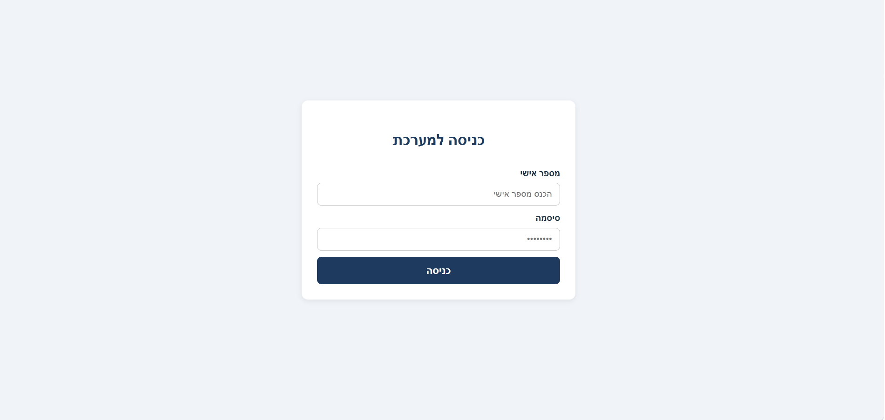
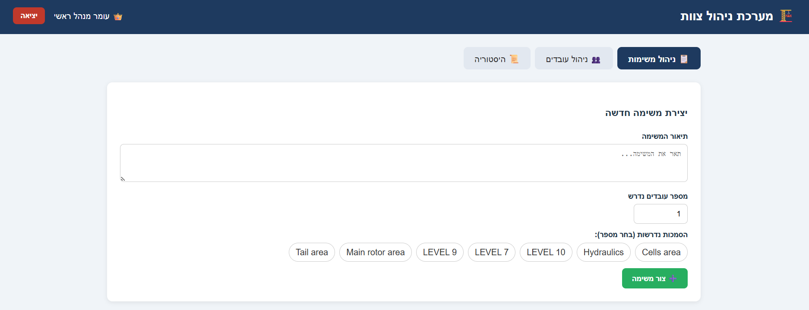
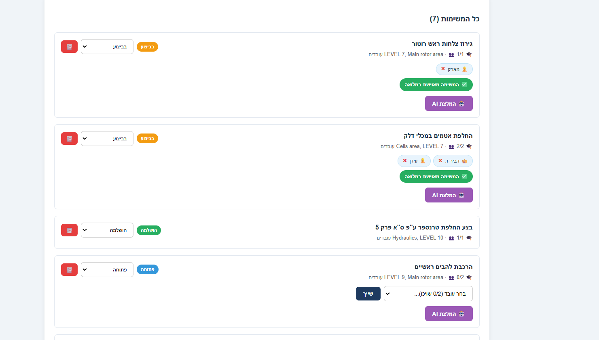
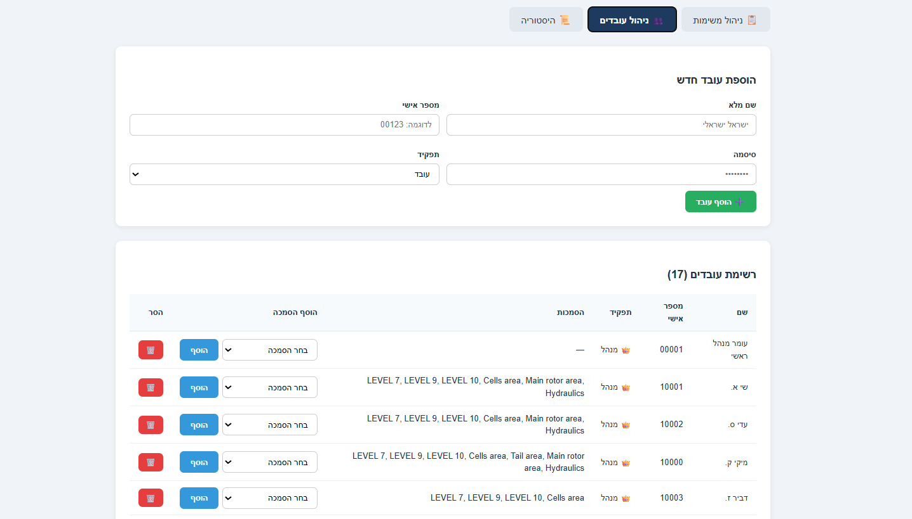
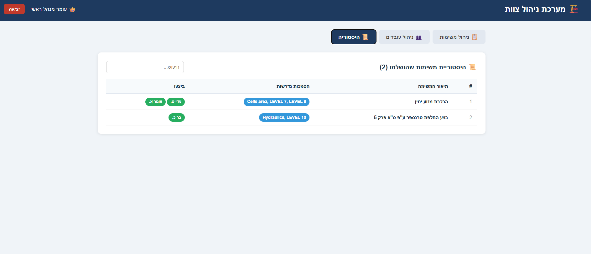
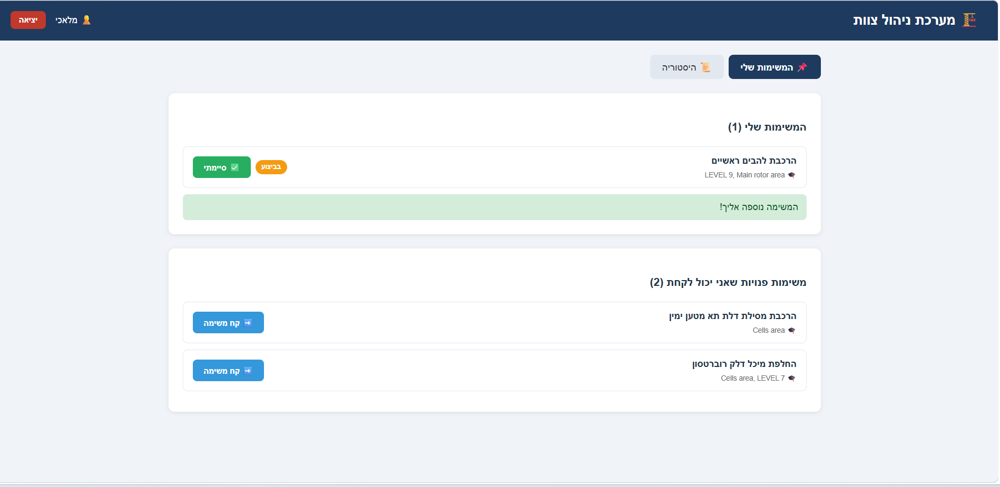
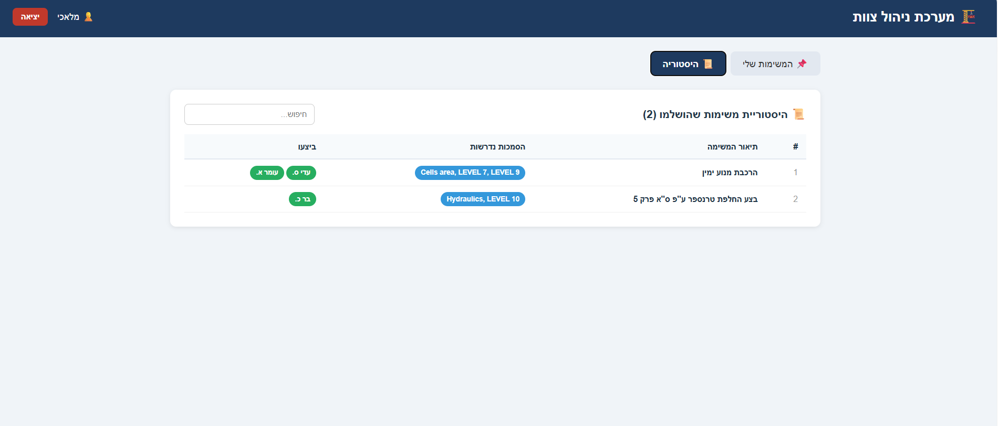

# Crew Management System

## Overview

**Crew Management** is a robust, full-stack management solution designed to streamline task coordination and personnel oversight in technical and operational environments. Built with a focus on efficiency and reliability, the system provides a centralized platform for managing employee records, tracking professional certifications, and orchestrating complex task assignments.
### Key Featureser

- Role-Based Access Control: Features distinct workflows for Managers (administrative oversight, task creation) and Employees (task reporting, self-assignment).
- AI-Driven Decision Support: Integrated with Claude AI (Anthropic) to analyze task requirements and employee profiles, providing intelligent recommendations for the most qualified personnel.
- Secure Authentication & Hashing: Protects user credentials using the Bcrypt algorithm for secure password hashing and JSON Web Tokens (JWT) for secure, stateless session management.
- Automated Certification Tracking: A smart validation engine that ensures tasks are only assigned to employees who hold the required professional certifications.
- Containerized Deployment: Orchestrated via Docker Compose to ensure seamless setup and identical environments across development and production.
- Real-time Task Management: Enables dynamic status updates (Open, In Progress, Done) to maintain a live operational picture for the entire crew.

### Tech Stack
- **Frontend:** React (Vite).
- **Backend:** Python (FastAPI).
- **Database:** MySQL.
- **Infrastructure:** Docker & Docker Compose.
- **AI Engine:** Anthropic Claude API.


## Getting Started

Follow these steps to get the system up and running on your local machine using Docker.
### Prerequisites
- Docker and Docker Compose installed.
- An Anthropic API Key for AI features (optional).

### Installation & Setup

1. Clone the repository:
    ```bash
    git clone https://github.com/omer-zaadi/crew-management.git
    cd crew-management


2. Configure Environment Variables:
   A template file .env.example is provided in the root directory.
   To configure the system, copy the template to a new .env file and fill in your specific credentials.


3. Run with Docker Compose:
   ```bash
   docker compose up --build


4. Access the application:
   - **Frontend:** http://localhost
   - **API Documentation** (Swagger): http://localhost:8000/docs


## Usage

### Initial Login

- Personal ID: 00001
- Password: 123456

### Role Workflows

### For Managers:
- **Employee Management:** Add new crew members, assign professional certifications, or remove personnel from the system.
- **Task Orchestration:** Create new tasks, define required certifications, and set the number of workers needed.
- **AI Recommendations:** Use the Recommend feature to receive an AI-generated analysis (via Claude) suggesting the best employee for a specific task based on their current workload and skills.
- **Mission History:** View a log of all completed tasks and the employees who performed them.
### For Employees:
- **My Tasks:** View all currently assigned missions and their requirements.
- **Self-Assignment:** Browse open tasks and claim them—provided you meet the required certification criteria.
- **Progress Reporting:** Update task statuses to "In Progress" or "Done" to notify the manager and update the live operational status.

## Screenshots

### Login Page


### Managers Dashboard





### Employees Dashboard




